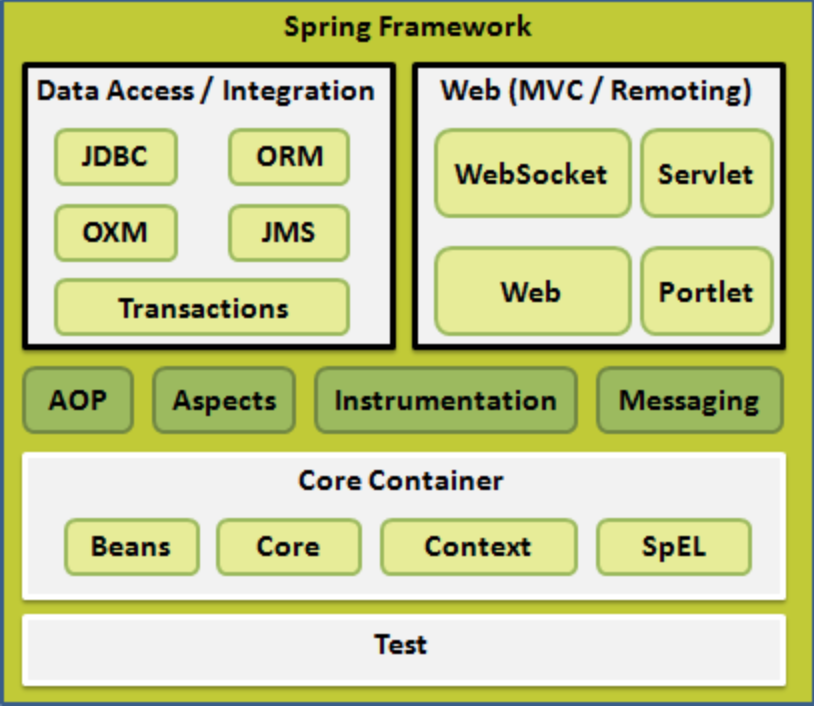
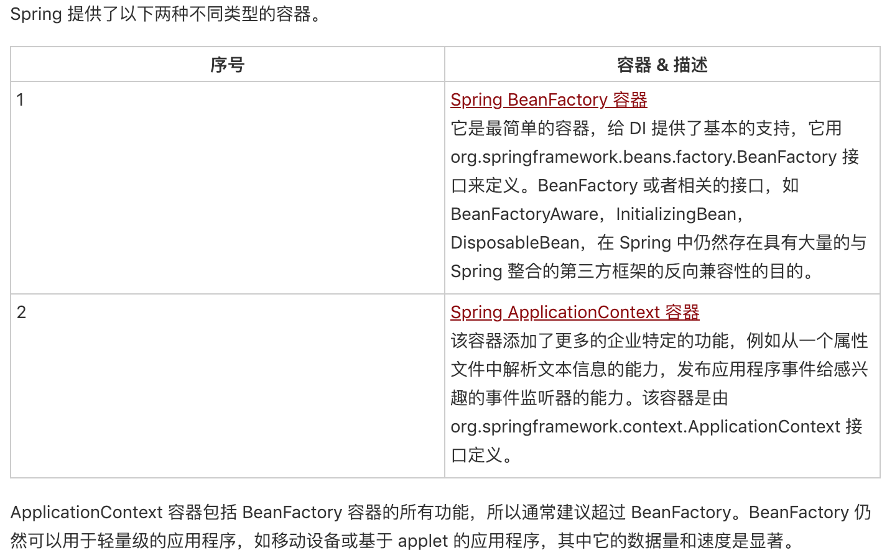

**Spring 学习用例**

学习地址：
    https://www.w3cschool.cn/wkspring/dcu91icn.html

一、Spring 体系结构

    Spring 有可能成为所有企业应用程序的一站式服务点，然而，Spring 是模块化的，允许你挑选和选择适用于你的模块，不必要把剩余部分也引入。下面的部分对在 Spring 框架中所有可用的模块给出了详细的介绍。
    Spring 框架提供约 20 个模块，可以根据应用程序的要求来使用。
    

   Spring IoC 容器
    
    Spring 容器是 Spring 框架的核心。容器将创建对象，把它们连接在一起，配置它们，并管理他们的整个生命周期从创建到销毁。Spring 容器使用依赖注入（DI）来管理组成一个应用程序的组件。这些对象被称为 Spring Beans

        
