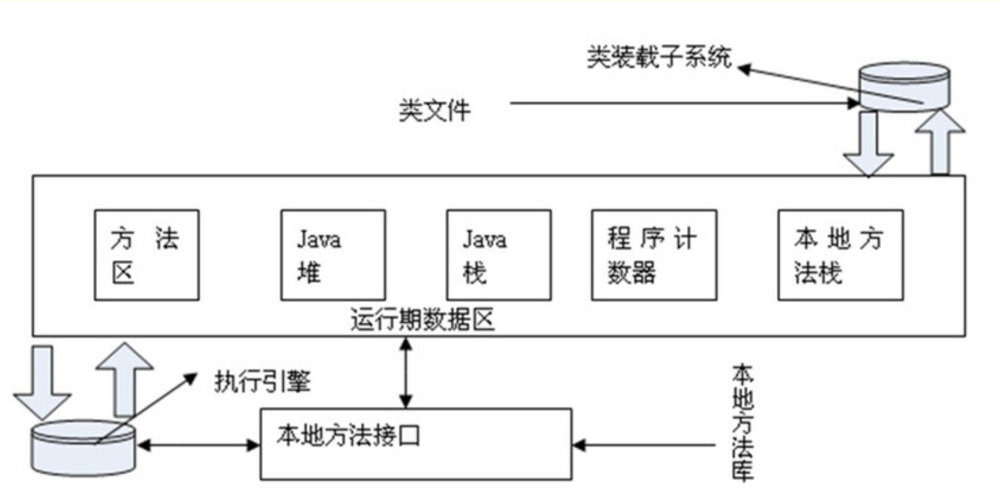
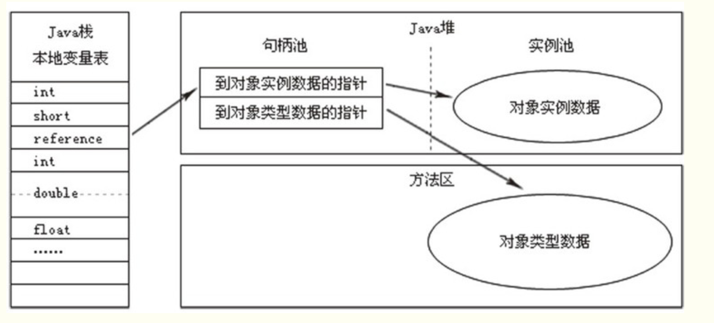

spring 之外的一些其他 知识点用例

spring没问，然后hashmap,并发的map,线程池，原子类，JVM，分布式id，分布式事务，缓存一致性，如何提高吞吐量，dubbo原理，自己设计rpc

学习资源：
	https://github.com/doocs/advanced-java （推荐）
	https://github.com/Snailclimb/JavaGuide 

面试题目：

一、jdk动态代理 原理及实现？  （例如aspect切面）
	
	关键：实现 Invocationhandler接口, 重写 invoke()方法；
	

二、 ConcurrentHashMap 结构。 为什么线程安全、 并发量跟什么有关（有几个Segment桶 == 锁的数量， 就有多少的并发）
    
                   线程完全       jdk1.7                             jdk1.8
        HashMap     不安全       数组+链表                        链表长度>8链表自动转化为红黑树（提高查询效率）     
        ConHMap     安全      分段数组+链表，分段锁（segment）      链表长度>8链表自动转化为红黑树，并且摒弃了segment（桶）分段锁，
                                                               对数组节点node加锁，锁数量增多，效率提升n倍数
        结论：
            为什么线程安全？ 因为加锁了；
            并发量 取决于 锁的数量（1.7: 桶的数量；  1.8: 锁的数量，数组节点的数量）    

三、 Atomic原子类 实现原理
	
	CAS 无锁，死循环
    无锁操作是使用CAS(compare and swap)又叫做比较交换来鉴别线程是否出现冲突，出现冲突就重试当前操作直到没有冲突为止;
    CAS是一种乐观锁策，即不会阻塞其他线程，
    
    问题：
        1.ABA问题
            因为CAS会检查旧值有没有变化，这里存在这样一个有意思的问题。比如
        一个旧值A变为了成B，然后再变成A，刚好在做CAS时检查发现旧值并没有变化依然为A，但是实际上的确发生了变化。
        解决方案可以沿袭数据库中常用的乐观锁方式，添加一个版本号可以解决。原来的变化路径A->B->A就变成了1A->2B->3C。

        2.自旋时间过长
            使用CAS时非阻塞同步，也就是说不会将线程挂起，会自旋（无非就是一个死循环）进行下一次尝试，如果这里自旋时间过长对性能是很大的消耗。
            如果JVM能支持处理器提供的pause指令，那么在效率上会有一定的提升。
            
            这也是为什么atomic类不能在大并发的场景下适用的原因；  大并发导致自旋操作飙升，等于是很多的死循环 ——> CPU飙升，
            并发越高，失败的次数会越多，CAS如果长时间不成功，会极大的增加CPU的开销。因此CAS不适合竞争十分频繁的场景。

           使用场景
            小并发的 场景下使用；  
               为啥大并发不能用？（因为无锁，死循环+大并发 -》cpu 飙升）
           
   

四、线程池。***** 必问
	原理解析：
	
	1.关键参数： pool数量。队列长度	
			ThreadPoolExecutor(int corePoolSize,		核心线程数   the number of threads to keep in the pool, even if they are idle, unless {@code allowCoreThreadTimeOut} is set       
                              int maximumPoolSize,		最大数     the maximum number of threads to allow in the pool
                              long keepAliveTime,		空闲到销毁的时间    when the number of threads is greater than the core, this is the maximum time that excess idle threads will wait for new tasks before terminating.
                              TimeUnit unit,			时间单位
                              BlockingQueue<Runnable> workQueue,	队列  the queue to use for holding tasks before they are
                                                                 *        executed.  This queue will hold only the {@code Runnable}
                                                                 *        tasks submitted by the {@code execute} method.        
                                                                 *  装Runnable（只包含被execute()方法提交的task任务）的任务队列
                              ThreadFactory threadFactory,		 创建新的线程时           the factory to use when the executor creates a new thread    那队列中的task任务创建新的线程
                              RejectedExecutionHandler handler)  线程池的拒绝策略（有）	the handler to use when execution is blocked
                                                                               *        because the thread bounds and queue capacities are reached
                                                                               *    即线程个数超标 和 队列塞满 的情况下，都会导致新任务添加失败，这时候如何执行策略？
                                                                               在它的 rejectedExecution(Runnable r, ThreadPoolExecutor executor) 方法中去处理

    详细的线程池参数介绍和使用：
    https://blog.csdn.net/jgteng/article/details/54409887

    ThreadFactory 
        内部包含一个 newThread(Runnable) 方法， 就是用来创建线程的;
    	定制线程thread

	2.线程池的拒绝策略：
    https://blog.csdn.net/jgteng/article/details/54411423
    
    其实都在ThreadPoolExecutor类中，定义了这四种已有的策略，查看源码即可理解；
        1.AbortPolicy(默认)       抛出异常
        2.DiscardPolicy           空方法，啥都不做，不管
        3.DiscardOldestPolicy     获取队列，删除队列头（最早的）任务[queue.poll()]，然后添加当前任务
        4.CallerRunsPolicy       急性子，直接执行，[r.cun()] 直接主线程中执行当前任务，
    以上几种还不满足，自定义:
        5.自定义策略   实现 RejectedExecutionHandler 接口，重写 rejectedExecution()方法，在里面添加自己的逻辑即可；

    3.BlockingQueue队列的类型和区别 （都是实现了 BlockingQueue 接口的）
        1.LinkedBlockingQueue   链表结构   无界队列，FIFO，可以无限向队列中添加任务，直到内存溢出    Executors.newFixedThreadPool
        2.ArrayBlockingQueue    数组结构   有界队列（初始化时设置容量）有界队列，FIFO，需要指定队列大小，如果队列满了，会触发线程池的RejectedExecutionHandler逻辑
        3.SynchronousQueue  一种阻塞队列，其中每个 put 必须等待一个 take，反之亦然。同步队列没有任何内部容量，甚至连一个队列的容量都没有。
                            可以简单理解为是一个容量只有1的队列。Executors.newCachedThreadPool使用的是这个队列                           
        4.PriorityBlockingQueue 优先级队列，线程池会优先选取优先级高的任务执行，队列中的元素必须实现Comparable接口

    
五、jvm 类加载器  双亲委派机制
	https://www.cnblogs.com/protected/p/6420128.html
	https://www.cnblogs.com/developer-ios/p/5550789.html

    1. 类加载的过程 【.java -> .class -> 二进制字节码 -> jvm开辟内存、创建实例对象 -> 使用运行】
        a.加载    class文件转化为二进制字节流，存储到jvm的方法区中，等待验证；
        b.验证    为了确保Class文件的字节流中包含的信息符合当前虚拟机的要求（版本、规范、格式、安全性之类的，基本都是针对jvm虚拟机）
        c.准备    准备阶段是正式为变量分配内存并设置初始值，这些内存都将在方法区中进行分配，这里的变量仅包括类标量不包括实例变量。
        d.解析    解析是虚拟机将常量池的符号引用替换为直接引用的过程。
        e.初始化   是根据程序员制定的主观计划区初始化变量和其他资源，或者可以从另外一个角度来表达：初始化阶段是执行类构造器<clinit>()方法的过程。
                
    2. 类加载器
        各种类加载器，其实简单讲都是 将 各个加载器对应的（其实大多是jdk下面的）类库 加载到内存里，供开发者使用；
                    
    3. 双亲委派机制
        JVM在加载类时默认采用的是双亲委派机制。通俗的讲，就是某个特定的类加载器在接到加载类的请求时，首先将加载任务委托给父类加载器，依次递归，
        如果父类加载器可以完成类加载任务，就成功返回；只有父类加载器无法完成此加载任务时，才自己去加载。
    

	4. 内存模型 和 gc垃圾回收
		cms 回收算法
https://www.cnblogs.com/mikevictor07/p/5023776.html
https://www.cnblogs.com/dingyingsi/p/3760447.html
	    
	    JVM内存分区：5 块区域

	     1.【method area 方法区】线程共享的内存区域
	        它用于存储已被虚拟机加载的 类信息、常量、静态变量、即时编译器编译后的代码等数据。
	        
	        相对而言，垃圾收集行为在这个区域是比较少出现的，但并非数据进入了方法区就如永久代的名字一样“永久”存在了。
	        这个区域的内存回收目标主要是针对常量池的回收和对类型的卸载，一般来说这个区域的回收“成绩”比较难以令人满意，尤其是类型的卸载，条件相当苛刻，但是这部分区域的回收确实是有必要的
	     
	     
	     2.【Heap area  堆】 被所有线程共享，是Java虚拟机所管理的内存中最大的一块内存区域
	        唯一目的就是存放对象实例，几乎所有的对象实例都在这里分配内存
	        垃圾收集器管理的主要区域，因此很多时候也被称做“GC 堆”（Garbage Collected Heap，幸好国内没翻译成“垃圾堆”）
	        
	        分代收集算法
	        内部分为 新生代 + 老年代 两部分
	             年轻代：大部分对象在这里分配，通常来说会进行比较小但是比较频繁的回收，花费时间较短。
                 年老代：内存相对较大，对象会相对保留比较长的时间，大对象也一般分配在此，占用空间上升缓慢并且回收频率低，"stop-the-world" 会在它回收时发生，花费较长的时间。
                    如下图中，对象在年轻代分配，经过一些时间后可能会被移到年老代。其中的permanent generation为持久区，主要存放元数据如class data structures, interned strings等信息。GC 重点在于 young gen 和 old gen的回收。      
         
                    
	     3.【VM stack   java虚拟机栈】  线程私有的，生命周期与线程相同； 
	        存 局部变量 【各种基本数据类型（boolean、byte、char、short、int、float、long、double）、对象引用（指针、句柄）】
	        
	        对这个区域规定了两种异常状况：如果线程请求的栈深度大
            于虚拟机所允许的深度，将抛出StackOverflowError 异常；如果虚拟机栈可以动态扩展
            （当前大部分的Java 虚拟机都可动态扩展，只不过Java 虚拟机规范中也允许固定长度的
            虚拟机栈），当扩展时无法申请到足够的内存时会抛出OutOfMemoryError 异常。
         
            
	     4.【native method stack 本地方法栈】 
	        与虚拟机栈所发挥的作用是非常相似的，其区别不过是虚拟机栈为虚拟机执行Java 方法（也就是字节码）服务，
	        而本地方法栈则是为虚拟机使用到的Native 方法服务。虚拟机规范中对本地方法栈中的方法使用的语
            言、使用方式与数据结构并没有强制规定，因此具体的虚拟机可以自由实现它。甚至有的虚拟机（譬如Sun HotSpot 虚拟机）直接就把本地方法栈和虚拟机栈合二为一。
            与虚拟机栈一样，本地方法栈区域也会抛出StackOverflowError 和OutOfMemoryError异常。
	     
	     
	     5.【PC register  程序计数器】        线程私有的，  唯一一个在Java 虚拟机规范中没有规定任何OutOfMemoryError 情况的内存区域。
	

    5. 字符串常量池 概念：
https://blog.csdn.net/bingguang1993/article/details/80921848	

	string字符串常量池 存在哪个位置？  
		 jdk1.7之前: 方法区 是存放在 永久代(PermGen)中，永久代和堆相互隔， 因此，其实是也可以说在 永久代 中； 
		        【string常量池 也在永久代中；】
		 
		 jdk1.7: 存储在永久代的 部分数据 就已经转移到Java Heap（堆）或者Native memory。
	            但永久代仍存在于JDK 1.7中，并没有完全移除，譬如符号引用(Symbols)转移到了native memory；
	            【字符串常量池(interned strings)转移到了Java heap堆中】；类的静态变量(class statics variables )转移到了Java heap；
	            
		 jdk1.8: 仍然保留方法区的概念，只不过实现方式不同。取消永久代，方法存放于元空间(Metaspace)，元空间仍然与堆不相连，但与堆共享物理内存，逻辑上可认为在堆中。
		        【string常量池 仍然在堆中】
		 
https://blog.csdn.net/qq_41872909/article/details/87903370
https://www.cnblogs.com/cherryljr/p/6230380.html

    
	6. OOM 如何排查， 
https://blog.51cto.com/wenshengzhu/2086935	

    --> 分析oom常见的可能区域： 堆、栈（jvm虚拟机栈 和 本地方法栈）、
    --> 分析oom常见的原因： JVM内存过小、程序不严密，产生了过多的垃圾、内存泄漏
    --> 根据错误日志，一般日志会告诉你是那部分内存溢出，（比如 java.lang.OutOfMemoryError: Java heap space，显然是堆溢出），然后尝试相应部分内存进行进一步分析；
    --> 可现尝试修改相应区域内存大小进行调整尝试，不行的话，再结合相关命令或工具进一步排查
    
    最常见的OOM情况有一下三种：
      java.lang.OutOfMemoryError: Java heap space ------>java堆内存溢出，此种情况最常见，一般由于内存泄露或者堆的大小设置不当引起。对于内存泄露，需要通过内存监控软件查找程序中的泄露代码，而堆大小可以通过虚拟机参数-Xms,-Xmx等修改。
      java.lang.OutOfMemoryError: PermGen space ------>java永久代溢出，即方法区溢出了，一般出现于大量Class或者jsp页面，或者采用cglib等反射机制的情况，因为上述情况会产生大量的Class信息存储于方法区。此种情况可以通过更改方法区的大小来解决，使用类似-XX:PermSize=64m -XX:MaxPermSize=256m的形式修改。另外，过多的常量尤其是字符串也会导致方法区溢出
      java.lang.StackOverflowError ------> 不会抛OOM error，但也是比较常见的Java内存溢出。JAVA虚拟机栈溢出，一般是由于程序中存在死循环或者深度递归调用造成的，栈大小设置太小也会出现此种溢出。可以通过虚拟机参数-Xss来设置栈的大小
       

	7. cpu100怎么排查解决	jmap， jstack
https://www.cnblogs.com/aflyun/p/9194104.html

        #top 命令查看 cpu 100 的pid（进程id）
        #jps -l  命令可以看到当前用户的所有进程的pid，和服务名称， 两者对照一下就知道了；
        
        

六、分布式id
	    
	    怎么生成分布式id，怎么保证全剧唯一
    	
    	分布式事务。 （干脆说不会）

        事务：
        
        mysql数据库本地事务ACID 
            原子性 Atomicity       操作要么全部完成，要么出错回滚，不会停在中间某个状态；【Undo Log】
            一致性 Consistency     一个事务执行之前和之后，数据库都是处于一致性状态，要么是完成状态，要么是出错回滚到初始状态；【Undo Log】
            隔离性 Isolation       各个事务之间相互隔离，各自执行不会互相干扰影响；   【锁机制】
            持久性 Durability      事务执行完毕之后，即便系统重启之后，数据还是保持重启之前的状态 【Redo Log（重做日志）】
            
            Undo Log 原理：
                很简单，为了满足事务的原子性，在操作任何数据之前，首先将数据备份到一个地方（这个存储数据备份的地方称为 Undo Log）。
            然后进行数据的修改。如果出现了错误或者用户执行了 Rollback 语句，系统可以利用 Undo Log 中的备份将数据恢复到事务开始之前的状态。
            
            Redo Log:
                和 Undo Log 相反，Redo Log 记录的是 新数据 的备份。在事务提交前，只要将 Redo Log 持久化即可，不需要将数据持久化。
            当系统崩溃时，虽然数据没有持久化，但是 Redo Log 已经持久化。系统可以根据 Redo Log 的内容，将所有数据恢复到最新的状态。对具体实现过程有兴趣的同学可以去自行搜索扩展。
        
        
        分布式事务：
            概念：
                分布式事务指事务的参与者、支持事务的服务器、资源服务器以及事务管理器分别位于不同的分布式系统的不同节点之上。
                简单的说，就是一次大的操作由不同的小操作组成，这些小的操作分布在不同的服务器上，且属于不同的应用，分布式事务需要保证这些小操作要么全部成功，要么全部失败。
                本质上来说，分布式事务就是为了保证不同数据库的数据一致性。
https://www.jianshu.com/p/16b1baf015e8

https://www.cnblogs.com/null-qige/p/8664009.html 
        mysql锁机制 （默认Innodb引擎下）：
        
                表锁：
                
                    显示的执行命令手动锁表：（一般用不到）
                        #LOCK TABLES xxx READ 
                        #UNLOCK TABLES 
                        
                1. Lock Table Read 读锁|共享锁 S       线程可共享，不阻塞；      【所有只能读，不能写； 未锁住的表不能访问】
                    不影响其他线程读，但是不可写（自己写也不行）； 
                    不允许对表进行更新操作(新增、删除也不行)，并且不允许访问未被锁住的表。
                    
                
                2. Lock Tables Write 写锁|排它锁 X     线程独占，阻塞     【只能自己读写；未锁住的表不能访问 】
                    会阻塞其他线程对数据 读和写。
                    允许对被锁住的表进行增删改查，但不允许对其他表进行访问。
                    
                Lock Tables....READ不会阻塞其他线程对表数据的读取，会阻塞其他线程对数据变更
                Lock Tables....READ不允许对表进行更新操作(新增、删除也不行)，并且不允许访问未被锁住的表
                Lock Tables....WRITE会阻塞其他线程对数据读和写
                Lock Tables....WRITE允许对被锁住的表进行增删改查，但不允许对其他表进行访问    
                
                        
        
七、缓存 和数据库的 一致性
    
	    先清除缓存旧值。-》 change db -> 再异步清缓存
	    最终一致性
	    
	    绝对一致：
	        串行化，加队列； 缺点：并发量大幅下降；
	        
	        

八、吞吐量：

        异步
        去锁
        批量  （批量操作）
        复用  （例如：线程池，线程复用）
        解偶

九、dubbo原理

    	consumer 到 produce 的访问流程
	    性能参数设定

十、rpc 设计
	远程调用 超时报错 如何实现；

===== vpn keychain 内容

	name: pritunl
	kind: application password
	account: 2fe7c32dfad3cc3ee29b9c060fbd6d0e
	where: pritunl
	password: PHRscy1hdXRoPgojCiMgMjA0OCBiaXQgT3BlblZQTiBzdGF0aWMga2V5CiMKLS0tLS1CRUdJTiBPcGVuVlBOIFN0YXRpYyBrZXkgVjEtLS0tLQpiY2RhOThjZTlkZmM4Y2I5NmVhMWU1ODJhNDhmZTA0Ngo0NWQ1MDdmNzQwMzdiMjU0ZTE4NWYzOTNiZGIwZmFjYwo3Y2ZhMmMyODY2MWE2OGEyNmQwZTI2MjczYmY4MWFhZAoxZWM0NTRiOTkxMjNhNzlhMmI1NDkwZTZmNTY0MTlkMwo1YjBiNmIzMGM3OGZlMGIzOWVkMjg5ZTM2Y2ZjZjFlNgplNjkyZTAwMDM2MWNiYmM5ZTYwOWU4YWFjZTI4MmJiZAo3YjZkYWU5MTA4Yzg3NGExZjQwNjIxOGUzZTYyZmJmYwpkNjhhNmZkYWEyNzNjYjY1YjFmNWJjNWU2ZjUzOTdmOApjN2NiMDhmZjUzOWVmNzg3NTQ5NzI3NmE3MzBmN2UzNwpmZWM0MWZmZjFmYTkxOGYxM2FkZGExNzEzNGI0OTdjYgo1OGUzYjE0N2U3YzZlMDQwNTZlMWUwZDA4ZTE3M2VhNApmMjEyODc1Yjc5ZGVlYmI1ZjdhODI3MzUwZjZlOTY1NQpkNzViY2JlZjQ2ZWVkOGIyMWY3ZTkxOGVjMzYyYjlmZQo5YTc1Y2M5NTU0NTY0MDM1MGEzOGNjNDg2NTYyODJkNgo3YzhhZmNkN2JmODE3MGUyZWE3MGI5YzEzMDMyMGM1OAoxYWUwNDc2NjQ2Mzg2ZWU0MTUyYzI1YjgxOWU2N2M5MgotLS0tLUVORCBPcGVuVlBOIFN0YXRpYyBrZXkgVjEtLS0tLQo8L3Rscy1hdXRoPgo8a2V5PgotLS0tLUJFR0lOIFBSSVZBVEUgS0VZLS0tLS0KTUlJSlFRSUJBREFOQmdrcWhraUc5dzBCQVFFRkFBU0NDU3N3Z2drbkFnRUFBb0lDQVFEZWJaTFk2eUF4enlXeApON3pKZ0R0QldkVG9RSkp3bnlBMS9vR01kUVVvcTNXL25lU0xhRmtEejVMU1ZYWUIyWWpwTXhhNG8zNTNZQ0t3Cit6Y2U1c1lzcGZUZkpUOFBEb1l6UHZwYUVLNXVnSFExYU1WbENyL1ZOUEJVdGpjN2ZwZW5XeXVoc01rbDJEL08KS0FiajZ4WWJVSjdqcGdKMS9ud1NzZWl6MS9USlRpaU9PUUE0Tyt5d2JCYTZCQ21WdlIxYThrb1ZSK0dTcWs3dAprTTlBUi8xNWxCUlFUSXcwTGFIREh0NzFoREg0aXNWeW1USDROOGk3LzZLb3VKTXVYRzZNZlZCb0pMSEVhS2dCCmhIRVdBVTVSWnhVamUvTDFmUG9hWnZIdHpOMDV1OHdhL1p3VG91S1lFSzU5RnUxeGV5THZuU1FCclZmbTllR1AKMzBqcUg3RVZBaGVRTnlrTy8zUmtXcUgxV20yeVJjZ1RJbzZyd0pSNG9jeXcxZVpRdSsvMGZVeWJWaTBhOVM1MAo3a1JBbU9EaGRaNUlsNk90LzBSYXBlUjRIS1JlaVpSdXN6dTdrcHZPclVXY040VWZ4bXpKUGo5Y2RiZHZJL3RjCnEzWkJNNUtKZmcrRHhHRXVVQStpQzdidHpLS3RqVnI1QjVobUZOeGtvU2R5Nmd3SWZJaUNReUFEQUVHTzdlSFUKZTBwQU55MHRNRnBIc1ZreU5EakJuODAwTmh5UUFjTGxuMmYxd0pvMFc4cEJNakJ5Y0ZFT3M4WnZpVWJza09qRQpzU0hqRTVWSm5TckVlN2d1NkRLMi9uL1MyTkJUU1BJTHd6QklWa1FYTjdocnFMZFlIQXNxY1pIOVRLOEJ1c25ZCjdzTWQrT0V1R05kRldYdzNHYUlDdWN5cnBtK1ZzUUlEQVFBQkFvSUNBRGtTaEl1RVNVNStpSDFnZitCME5zQWQKL0xOYlhqZm5uS3crRVorb3B4bzRaSTQyUlY0LytCY3lPOG9jZzVzVjVqdHdFSFJ2L3hOQ1o2UmgwVkxzaEEwUQp5RFE1cW1TQ3BZeWdyRHhQNjNJUEk4SlFqOVhOWEV1b3VjSUN2MGxVd2pUKy84TU5TWStjWFVMWW9tdjQ5a01yCi9Ka05EN1NYQjk4RUoyRitHQ0ZQSExqaGgxem1nMlVCVnhPRDNlZStEcm8zVVNzRXRxeWJab1V1a3Y4N2VaNm8Ka0UzS1ZtOU5CaVM2MXhySVFNbzFVVlNHV253R1ZFdG8zS1BPT0hXODRlREtoc2N5SXlyeWI2bDBBbEJUSlhWZApyZDdjL3dwZWR3NHZQQVI0Zkl0RDFLdFlSNlFDTjRJdFJaaHpPWm5VcnJJczhBQStLai9vOTJlak0ySmZuMS82Ckk5YlVadUR4N2FlK2JKK1RwY3Fsd1F0bzZpTEpxVFVlQm8xcUNYNGcvdklBTXE2TnFjamt0MXcySVRRUU9tdzMKWjNWeUFETUtlWk1UMTNXV29ONTgySG5lT2cwVkh2MS8wbnQ1RWRCRzRxMFJTdkJxaEhQcFk5YjdkdklaVllCcwp2MlhqVUp5OWpjbWp6dDN5NU9WWitBUXNaNzlBVHhpVWZSWFV5dDNkMGxMRU5weVJ5cmJuNU9SbWFZREpCcEZwCmNSdUhCUVB3Q2JTZ0duYnpQTVhySzViQnhQbk5EenBGZ0k5b3dQT2V4VjVMekNVVGdrSFNhSHdhQTMwcjNwSXgKU3NVRDAxTVp2c1crbTk2UEpCN0gvclNvSjVuUVVDREZ3QXdEd3F4M0cweXp0Znl3UGJxMStLSGU3aHRwT0RNYgptUkZKR0VrTDlqSyswalZOS1pVQkFvSUJBUUR2dWZGQmxJUEZJQVRIbWNDaFFHVVpLVEsrdmVtTm9MWU5nMUpICkFrUVVVSnNJQksrT1k5K1B3MDhkZG9YMXU2eGYydGNHL2tIOGNra25hRVFFaWo5VWtPYjhzTXEvY011VGM3emgKOGJFT0liZUZjWWZQL2hJQnNIaXZQVVpnUVlQWWtLTXJyOG45Vk5JcXVrK1hPcWxDRlZRckxoTkxGd2ozbDRXMwo3TUlXeWdDR0tNNTRzdWJ1M2NkZkpoY1pWNzZqRGdxNGJkUjMzWU5wUUhtU3lGaEFRZDNhZ2dFVVQ3RGRiSzZzCjJTMm5ycWFFb2ZJTDRUNWNKYjVqNGg2dUV1VWVQaFNEMGR2V3NUT3BneHZBSVA5eEZHVW1PdjY4citWdkozT0MKNzNiSGp5bE1zRnRDMjZQOVBoL1lSZTJKbDRmV1hhQllnSGg2TElyQ05iVU10VWhGQW9JQkFRRHRod09zeVJOQQo3VysxekJLZVRUeHZiU3RDbXIveTg4ZFhOdTFKSDF1b1pkSE1hUkVLNHZPUVNNb0diaGRySlVMdzdXTU15T2hSCkQzeTFJVFNjUkM3VXNkUldnM1lUQzR6NzNDeWR0MWIxMzVkaXN3TFlFZ3pKUk11aldTdExDbnJGNU9WdFBMZW4Kay9sRFF6cU8vK0kxNEpac01DeXEzSnN1ZUNSMWxTQkVYd1B6M3hRLzFhWUNBTEtTRUpDWk56RHRPcC84RStCMQp3VHNrRFRzSjBZVldFRGwveVlaTktJdDFyT2RqUEFzUFlPM2o5ako1SlEwaFhMNm01RkR6VmhkSXB5djRnT1FLCnFEL21uemw4Z3NqUjBJeHlKVDRJQXdGM011dnBKbUtGVTBUZnFoZFpFc1h2YmFUQmV4VkpQQkNsTHF1TUtmM2oKYmJHZVhXcU5rTng5QW9JQkFEaC81SUtHVkVBamVienBXZU1uWUN4Nzd6L1JWcmhRaGxmTStabE95V2pZVHBHbgpPUkVnTE5LZlA0ZzhKUHB6anY3UWZ4bGcxNEIrRnd1NG9UOUlyZ0JxWG1aejdIVU9Tb3lvSEg1TURtUzhRWnFyCjFVeUtId2hTNVQ2My9GdzNWTEczOVIwWXcweDNyMGp1dkU5eVBlNGJSTWtnaE4rUHdFZEthUE9lVTJnM2w4UUcKM2hMSVozRW95QkorMGJiaFhVYmt5bFlKWEtnYmh4dEpYTjNoWmh0TzZ0RFREeG9RWmlqcHNvbCtiaW8xR1gzdApCVFVUa3pUNG1GVEdPR0RpaHltSGpDSTlWY2pWM3MwMjMxVjY4WGxmU3krbGUrQlF2SXhrQ2U5MExOUi93MFlWCjBveUJZN2NONjBkM3c3SklDblhWZnpNY3BFaDNNd1R1ejRyOU50a0NnZ0VBTkZldVhhTXAxUUw5dlFndGlpam4KQ243Nks0RkNqMTFkTGtEeVpVeTl2QXhFQVZHZDZkSTliaXc4S05LVjRveWhoY29xSzZVU1hOcVcxcXRzbG9zSAo3dU1KTWM5aWM2djE4NEovYW5uK2RjeEI1Z1FndWxDdjlLSnVaWjYreFppWG1ZaHBibnNVMVo3c0xRQmhwU1dLClNla2wvTTFZNm9ZV3hGVEJaQS9xdm1aWnpxSDRLbUVBWml5VkxVN3RMblpWRjlIMWMyMUY1MjBmaFVCTkpFckIKb1VlT0JEVDZuWUl6eVVqQzdNRk1ocVVMaDFLM3FLNmJpQ0NSK3VFUlhhNDVEMCtYaHZtUVJ6RHdjL2ZlaVN1Zwo2V3VWcDRuQmM2NkY0aWljaUJKblg0NEwvV1hVSTFMWnYzdGY5U3NVYzhFQ3dnUFkxZGhqRkgwVnlSbzQ0dDFyCldRS0NBUUJ1cXA2SXFHNkcxamJmcTA1R2Mrd0FRdjR1dkZYay8rblppOUVkODRnbnJsU2k1M0srQzUvSER2UFEKV0pTbXJKVy95Mkxpdkc0NDdwNXZZU3hUYURmTktDUHY1ZEpTRytvcnk0M0x4SzFSYnN5WHc3Mmh6amxlNGtoaQpQbDlFbVdKK0RINHF1Ly96TkUyWFIzL3hxSzVRVGtRSlN1NTBOSGw4b3ZENHFna1loSS92Rm9CQVBLdUJNWjVsCllsMEsxTzhlNDhHeGV4L3BYMVMzRjBTN2VPR2ZlUHhPb3duVmRxei9zcEQ0ZFd4YjFuM0V4YTk5NkEzR3p5bEcKaDBjc1lsaHUvem5ucG1sZjZIamQycTU0MVF3bHZNWmFIUkUrOS9JSFllODV1aUtBRmdMK0ZIdW9jYUhLaWlqagpKSVo5YlNXM08zaGZVYTR0Wm1acFJ3YnlGRmFECi0tLS0tRU5EIFBSSVZBVEUgS0VZLS0tLS0KPC9rZXk

	

